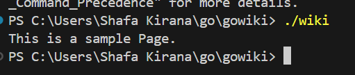
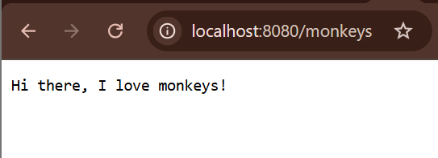
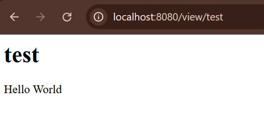
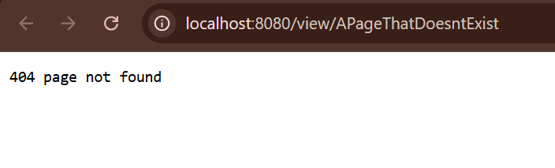
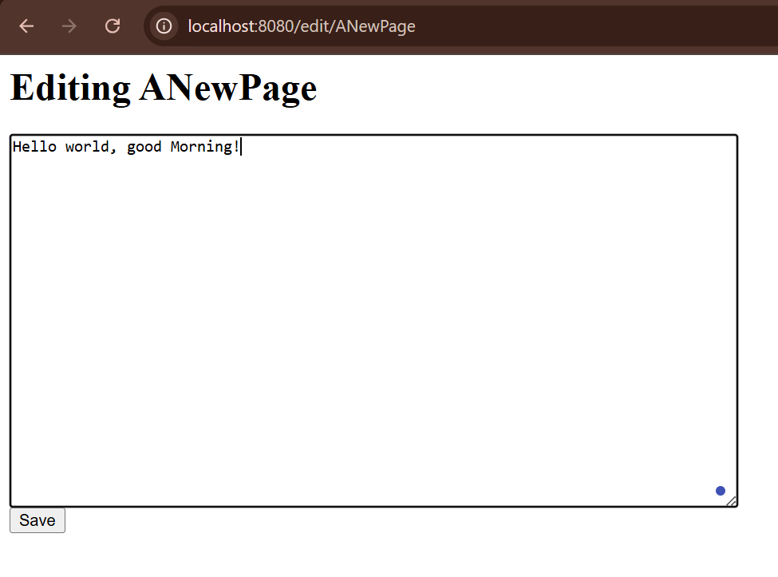

# Framework Programming IUP - Golang Web Application Project

Created by: Shafa Kirana Mulia - 5025221078

## Data Structures

Defining the data structures (title and a body). Then create a save method on `Page`

```go
package main

import (
    "fmt"
    "os"
)

type Page struct {
    Title string
    Body  []byte
}

func (p *Page) save() error {
    filename := p.Title + ".txt"
    return os.WriteFile(filename, p.Body, 0600)
}
```
 
Then, in addition to saving pages, we will want to load pages by adding `func loadPage` and add the `main` function:

```go
func loadPage(title string) (*Page, error) {
    filename := title + ".txt"
    body, err := os.ReadFile(filename)
    if err != nil {
        return nil, err
    }
    return &Page{Title: title, Body: body}, nil
}

func main() {
    p1 := &Page{Title: "TestPage", Body: []byte("This is a sample Page.")}
    p1.save()
    p2, _ := loadPage("TestPage")
    fmt.Println(string(p2.Body))
}
```

To compile and run the program, we use:

```
$ go build wiki.go
$ .\wiki.exe
This is a sample Page.
```
Result:
<div align="center">
    
</div>

## Introducing the net/http package
A simple web server:
```go
package main

import (
    "fmt"
    "log"
    "net/http"
)

func handler(w http.ResponseWriter, r *http.Request) {
    fmt.Fprintf(w, "Hi there, I love %s!", r.URL.Path[1:])
}

func main() {
    http.HandleFunc("/", handler)
    log.Fatal(http.ListenAndServe(":8080", nil))
}
```

Result by testing at `http://localhost:8080/monkeys`:
<div align="center">
    
</div>

## Using net/http to serve wiki pages¶
We create handler function which called `viewHandler`. Don't forget to add import `"net/http"` and `"os"`. After that, create `test.txt` and fill in some text. 

```go
func viewHandler(w http.ResponseWriter, r *http.Request) {
	title := r.URL.Path[len("/view/"):]
	p, _ := loadPage(title)
	fmt.Fprintf(w, "<h1>%s</h1><div>%s</div>", p.Title, p.Body)
}

func main() {
	http.HandleFunc("/view/", viewHandler)
	log.Fatal(http.ListenAndServe(":8080", nil))
}
```

Result by testing at `http://localhost:8080/view/test`:
<div align="center">
    
</div>

## Editing Pages and The html/template package
We add the `editHandler` and modify the `viewHandler`. Then create a template file named `edit.html` and `view.html`. Don't forget to add import `"html/template"`

```go
func renderTemplate(w http.ResponseWriter, tmpl string, p *Page) {
	t, _ := template.ParseFiles(tmpl + ".html")
	t.Execute(w, p)
}

func viewHandler(w http.ResponseWriter, r *http.Request) {
	title := r.URL.Path[len("/view/"):]
	p, _ := loadPage(title)
	renderTemplate(w, "view", p)
}

func editHandler(w http.ResponseWriter, r *http.Request) {
	title := r.URL.Path[len("/edit/"):]
	p, err := loadPage(title)
	if err != nil {
		p = &Page{Title: title}
	}
	renderTemplate(w, "edit", p)
}

func main() {
	http.HandleFunc("/view/", viewHandler)
	http.HandleFunc("/edit/", editHandler)
	//http.HandleFunc("/save/", saveHandler)
	log.Fatal(http.ListenAndServe(":8080", nil))
}
```

## Handling non-existent pages
If we visit `/view/APageThatDoesntExist` we will see a page containing HTML because it ignores the error return value from loadPage and continues to try and fill out the template with no data. Instead, if the requested Page doesn't exist, it should redirect the client to the edit Page so the content may be created, so we modify the `viewHandler`

```go
func viewHandler(w http.ResponseWriter, r *http.Request) {
    title := r.URL.Path[len("/view/"):]
    p, err := loadPage(title)
    if err != nil {
        http.Redirect(w, r, "/edit/"+title, http.StatusFound)
        return
    }
    renderTemplate(w, "view", p)
}
```
Result by testing at `http://localhost:8080/view/APageThatDoesntExist`:
<div align="center">
    
</div>

## Saving Pages
Add `saveHandler` for handling the submissions of forms located on the edit pages.

```go
func saveHandler(w http.ResponseWriter, r *http.Request) {
    title := r.URL.Path[len("/save/"):]
    body := r.FormValue("body")
    p := &Page{Title: title, Body: []byte(body)}
    p.save()
    http.Redirect(w, r, "/view/"+title, http.StatusFound)
}
```

## Error Handling
First, handle errors in `renderTemplate`, then modify `saveHandler` so that any errors that occur during `p.save()` will be reported to the user.

```go
func renderTemplate(w http.ResponseWriter, tmpl string, p *Page) {
    t, err := template.ParseFiles(tmpl + ".html")
    if err != nil {
        http.Error(w, err.Error(), http.StatusInternalServerError)
        return
    }
    err = t.Execute(w, p)
    if err != nil {
        http.Error(w, err.Error(), http.StatusInternalServerError)
    }
}

func saveHandler(w http.ResponseWriter, r *http.Request) {
    title := r.URL.Path[len("/save/"):]
    body := r.FormValue("body")
    p := &Page{Title: title, Body: []byte(body)}
    err := p.save()
    if err != nil {
        http.Error(w, err.Error(), http.StatusInternalServerError)
        return
    }
    http.Redirect(w, r, "/view/"+title, http.StatusFound)
}
```

## Template Caching
Parse all templates to a single `*Template` for a better approach to call `ParseFiles` once at program initialization. We create global variable and modify `renderTemplate` to call the `templates.ExecuteTemplate` :

```go
var templates = template.Must(template.ParseFiles("edit.html", "view.html"))

func renderTemplate(w http.ResponseWriter, tmpl string, p *Page) {
    err := templates.ExecuteTemplate(w, tmpl+".html", p)
    if err != nil {
        http.Error(w, err.Error(), http.StatusInternalServerError)
    }
}
```

## Validation
Add import `"regexp"` and create global variable `validPath`. Then, write `func getTitle` to validate path and extract the page title, Then, put a call to `getTitle` in each of the handlers:

```go
var validPath = regexp.MustCompile("^/(edit|save|view)/([a-zA-Z0-9]+)$")

...

func getTitle(w http.ResponseWriter, r *http.Request) (string, error) {
    m := validPath.FindStringSubmatch(r.URL.Path)
    if m == nil {
        http.NotFound(w, r)
        return "", errors.New("invalid Page Title")
    }
    return m[2], nil // The title is the second subexpression.
}

...

func viewHandler(w http.ResponseWriter, r *http.Request) {
    title, err := getTitle(w, r)
    if err != nil {
        return
    }
    p, err := loadPage(title)
    if err != nil {
        http.Redirect(w, r, "/edit/"+title, http.StatusFound)
        return
    }
    renderTemplate(w, "view", p)
}

func editHandler(w http.ResponseWriter, r *http.Request) {
    title, err := getTitle(w, r)
    if err != nil {
        return
    }
    p, err := loadPage(title)
    if err != nil {
        p = &Page{Title: title}
    }
    renderTemplate(w, "edit", p)
}

func saveHandler(w http.ResponseWriter, r *http.Request) {
    title, err := getTitle(w, r)
    if err != nil {
        return
    }
    body := r.FormValue("body")
    p := &Page{Title: title, Body: []byte(body)}
    err = p.save()
    if err != nil {
        http.Error(w, err.Error(), http.StatusInternalServerError)
        return
    }
    http.Redirect(w, r, "/view/"+title, http.StatusFound)
}
```

## Introducing Function Literals and Closures
We could wrap each of the handlers in a function that does this validation and error checking by using Go's function literals. We can apply by rewrite the function definition of each of the handlers to accept a title string, then define a wrapper function to extract the page title fromt the `Request` and call the provided handler `fn`.

Final code:
```go
package main

import (
	"errors"
	"fmt"
	"html/template"
	"log"
	"net/http"
	"os"
	"regexp"
)

var templates = template.Must(template.ParseFiles("edit.html", "view.html"))
var validPath = regexp.MustCompile("^/(edit|save|view)/([a-zA-Z0-9]+)$")

type Page struct {
	Title string
	Body  []byte
}

func (p *Page) save() error {
	filename := p.Title + ".txt"
	return os.WriteFile(filename, p.Body, 0600)
}

func loadPage(title string) (*Page, error) {
	filename := title + ".txt"
	body, err := os.ReadFile(filename)
	if err != nil {
		return nil, err
	}
	return &Page{Title: title, Body: body}, nil
}

func handler(w http.ResponseWriter, r *http.Request) {
	fmt.Fprintf(w, "Hi there, I love %s!", r.URL.Path[1:])
}

func getTitle(w http.ResponseWriter, r *http.Request) (string, error) {
	m := validPath.FindStringSubmatch(r.URL.Path)
	if m == nil {
		http.NotFound(w, r)
		return "", errors.New("invalid Page Title")
	}
	return m[2], nil // The title is the second subexpression.
}

func renderTemplate(w http.ResponseWriter, tmpl string, p *Page) {
	// t, err := template.ParseFiles(tmpl + ".html")
	err := templates.ExecuteTemplate(w, tmpl+".html", p)
	if err != nil {
		http.Error(w, err.Error(), http.StatusInternalServerError)
	}
}

func viewHandler(w http.ResponseWriter, r *http.Request, title string) {
	p, err := loadPage(title)
	if err != nil {
		http.Redirect(w, r, "/edit/"+title, http.StatusFound)
		return
	}
	renderTemplate(w, "view", p)
}

func editHandler(w http.ResponseWriter, r *http.Request, title string) {
	p, err := loadPage(title)
	if err != nil {
		p = &Page{Title: title}
	}
	renderTemplate(w, "edit", p)
}

func saveHandler(w http.ResponseWriter, r *http.Request, title string) {
	body := r.FormValue("body")
	p := &Page{Title: title, Body: []byte(body)}
	err := p.save()
	if err != nil {
		http.Error(w, err.Error(), http.StatusInternalServerError)
		return
	}
	http.Redirect(w, r, "/view/"+title, http.StatusFound)
}

func makeHandler(fn func(http.ResponseWriter, *http.Request, string)) http.HandlerFunc {
	return func(w http.ResponseWriter, r *http.Request) {
		m := validPath.FindStringSubmatch(r.URL.Path)
		if m == nil {
			http.NotFound(w, r)
			return
		}
		fn(w, r, m[2])
	}
}

func main() {
	// http.HandleFunc("/view", viewHandler)
	// http.HandleFunc("/edit/", editHandler)
	// http.HandleFunc("/save/", saveHandler)

	http.HandleFunc("/view/", makeHandler(viewHandler))
	http.HandleFunc("/edit/", makeHandler(editHandler))
	http.HandleFunc("/save/", makeHandler(saveHandler))

	log.Fatal(http.ListenAndServe(":8080", nil))
}
```

Result by testing at `http://localhost:8080/view/ANewPage`:

<div align="center">
    
</div>

This action also will create a new txt file named `ANewPage.txt` that will change according to our changes and savings at the `localhost`.
